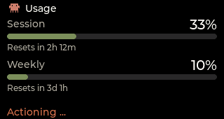
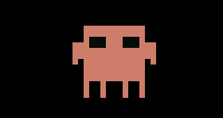

# Clawdmeter

A small ESP32 dashboard that sits on your desk and keeps an eye on Claude
Code usage. It connects to a host daemon over BLE, the daemon polls the
Anthropic API every 60 s, and the device renders session + weekly usage,
reset timers, and a pixel-art Clawd that gets busier as your usage rate
climbs. Two side buttons send keyboard shortcuts back over BLE HID for
Claude Code's voice mode and mode toggle.

> **Fork of [HermannBjorgvin/Clawdmeter](https://github.com/HermannBjorgvin/Clawdmeter)**
> by [@hermannbjorgvin](https://github.com/HermannBjorgvin) — the
> original targets the Waveshare ESP32-S3-Touch-AMOLED-2.16. This fork
> adds support for the **LilyGO T-Display S3** (1.9" 170×320 ST7789, two
> buttons, no touch/IMU/PMU) and a **celebration animation** that fires
> whenever Claude Code finishes a response.

## Two supported boards

| Board                                | PlatformIO env             | Display                          | Inputs                           | Battery / PMU              |
| ------------------------------------ | -------------------------- | -------------------------------- | -------------------------------- | -------------------------- |
| Waveshare ESP32-S3-Touch-AMOLED-2.16 | `waveshare_amoled_216`     | 480×480 AMOLED (CO5300 QSPI)     | Cap-touch + 3 buttons + IMU      | AXP2101 + Li-Po            |
| **LilyGO T-Display S3**              | `tdisplay_s3` *(this fork)*| 320×170 IPS (ST7789 8-bit i80)   | 2 buttons (short = HID, long = cycle) | ADC battery, no charge sense |

The two boards share BLE, daemon, splash data, usage-rate logic, and
theming. The display drivers, layouts, fonts, and power paths live under
`firmware/src/boards/<name>/` and are selected by `build_src_filter` per
env.

|              T-Display S3 — Usage              |              Celebration on prompt-ready              |
| :--------------------------------------------: | :---------------------------------------------------: |
|  |  |

|              AMOLED — Splash               |              AMOLED — Usage              |                AMOLED — Bluetooth                |
| :----------------------------------------: | :--------------------------------------: | :----------------------------------------------: |
|           |           |           |

The Clawd animations come from [claudepix](https://claudepix.vercel.app),
[@amaanbuilds](https://x.com/amaanbuilds)'s library of pixel-art Clawd
sprites.

## Screens

Both builds expose three screens:

- **Usage** — session + weekly percentages, reset times, animated Claude Code-style "doing thing" message.
- **Bluetooth** — connection state, device name, MAC address.
- **Splash** — full-screen pixel-art Clawd, auto-rotating across animations within the current usage-rate group.

On the **AMOLED** build the middle (PWR) button cycles between Usage and
Bluetooth; tapping the screen flips into and out of the splash. On the
**T-Display S3** build (no touch, no third button), long-pressing either
side button (≥500 ms) cycles Usage → Bluetooth → Splash → Usage.

## Prerequisites

- Linux (tested on Ubuntu) — macOS is technically supported but untested by either of us; pull requests welcome.
- [PlatformIO CLI](https://docs.platformio.org/en/latest/core/installation/index.html) (`pipx install platformio` works well)
- `curl`, `jq`, `awk`, `bluetoothctl`, `busctl` (BlueZ Bluetooth stack)
- `ffmpeg` and Python with `pyserial` (only needed for `./screenshot.sh`)
- Claude Code with an active subscription

## Flash the firmware

Pick the env that matches your board. The default is `tdisplay_s3`:

```bash
# T-Display S3
pio run -d firmware -e tdisplay_s3 -t upload --upload-port /dev/ttyACM0

# Waveshare AMOLED
pio run -d firmware -e waveshare_amoled_216 -t upload --upload-port /dev/ttyACM0
```

Or via the helper script:

```bash
./flash.sh                                       # uses BOARD env var (default: tdisplay_s3)
BOARD=waveshare_amoled_216 ./flash.sh
```

## Bluetooth pairing

After flashing, the device advertises as `Claude Controller`. The daemon
does auto-discovery on first run by name, so no manual pairing is
required — just start the daemon below. If you want to pair it manually
for some reason:

```bash
bluetoothctl scan le
bluetoothctl pair F4:12:FA:C0:8F:E5    # use your device's BLE MAC
bluetoothctl trust F4:12:FA:C0:8F:E5
```

The MAC is shown on the Bluetooth screen.

## Install the daemon

The daemon polls Claude usage every 60 s and writes it to the device
over BLE.

```bash
./install.sh                                # installs a systemd --user service
systemctl --user start claude-usage-daemon

# Or run in foreground for development:
bash daemon/claude-usage-daemon.sh
```

Status / logs:

```bash
systemctl --user status claude-usage-daemon
journalctl --user -u claude-usage-daemon -f
```

## How it works

1. Daemon reads your Claude Code OAuth token from `~/.claude/.credentials.json`.
2. Makes a minimal API call to `api.anthropic.com/v1/messages` — one Haiku token, basically free.
3. Usage numbers come straight from the response headers (`anthropic-ratelimit-unified-5h-utilization` and friends).
4. Daemon writes a JSON payload to the device's GATT RX characteristic.
5. Firmware parses it and updates the LVGL dashboard.
6. Firmware tracks the rate of change of session % over a 5-minute ring buffer and picks splash animations from a matching mood group (idle / normal / active / heavy).
7. The side buttons send Space and Shift+Tab as BLE HID keyboard reports — independent of the data channel — to drive Claude Code's voice mode and mode-toggle shortcuts.

## Celebration on prompt-ready (optional)

When Claude Code finishes responding the device can fire a celebration
animation — a random energetic Clawd dance pose for ~6 seconds, then
auto-return to whichever screen was visible before.

Add a `Stop` hook to `~/.claude/settings.json`:

```json
{
  "hooks": {
    "Stop": [
      {
        "matcher": "*",
        "hooks": [
          {
            "type": "command",
            "command": "/absolute/path/to/Clawdmeter/daemon/hooks/claude-stop.sh"
          }
        ]
      }
    ]
  }
}
```

The hook sends `SIGUSR1` to the running daemon; the daemon writes a tiny
`{"e":"done"}` event over BLE; the firmware plays the animation. Sub-second
latency end to end. No-op if the daemon isn't running.

> Wired on the `tdisplay_s3` firmware. The AMOLED build has a no-op
> `ui_celebrate()` stub — mirroring the tdisplay state machine in
> `boards/amoled/ui.cpp` is left as a TODO.

## Physical buttons

### Waveshare AMOLED (3 buttons)

| Button           | GPIO         | Action                                                       |
| ---------------- | ------------ | ------------------------------------------------------------ |
| **Left**         | GPIO 0       | Hold to send Space (Claude Code voice push-to-talk)          |
| **Middle** (PWR) | AXP2101 PKEY | Cycle screens (Usage ↔ Bluetooth); on splash, cycle animations |
| **Right**        | GPIO 18      | Press to send Shift+Tab (Claude Code mode toggle)            |

### T-Display S3 (2 buttons)

| Button     | GPIO    | Short press                | Long press (≥500 ms)            |
| ---------- | ------- | -------------------------- | ------------------------------- |
| **Left**   | GPIO 0  | Send Space                 | Cycle screen forward            |
| **Right**  | GPIO 14 | Send Shift+Tab             | Cycle screen forward            |

Space and Shift+Tab go out as standard BLE HID keyboard reports, so they
trigger in whatever window has focus on the paired host — not just
Claude Code.

## BLE protocol

The device advertises a custom GATT service alongside the standard HID
keyboard service:

|                            | UUID                                   |
| -------------------------- | -------------------------------------- |
| **Data service**           | `4c41555a-4465-7669-6365-000000000001` |
| RX characteristic (write)  | `4c41555a-4465-7669-6365-000000000002` |
| TX characteristic (notify) | `4c41555a-4465-7669-6365-000000000003` |
| REQ characteristic (notify) | `4c41555a-4465-7669-6365-000000000004` |
| **HID service**            | `00001812-0000-1000-8000-00805f9b34fb` |

Two payload shapes are accepted on the RX characteristic:

```json
// Usage update
{ "s": 45, "sr": 120, "w": 28, "wr": 7200, "st": "allowed", "ok": true }

// Event (currently only "done" = Claude finished responding)
{ "e": "done" }
```

Usage fields: `s` = session %, `sr` = session reset in minutes, `w` =
weekly %, `wr` = weekly reset in minutes, `st` = status string, `ok` =
success flag.

## QA your own UI changes

Both firmware builds expose a `screenshot` serial command that dumps the
LVGL framebuffer over `/dev/ttyACM0`:

```bash
./screenshot.sh out.png /dev/ttyACM0
```

Panel dimensions are auto-detected from what the device reports
(480×480 or 320×170), so the same script works on both boards.

## Recompiling fonts (AMOLED only)

The `firmware/src/boards/amoled/font_*.c` files are pre-compiled LVGL 9
bitmap fonts (Tiempos Text + Styrene B + DejaVu Sans Mono) at sizes
scaled for the AMOLED's 314 PPI. The T-Display S3 build uses LVGL's
built-in Montserrat 12/14/20 fonts instead and the FontAwesome symbol
subset, so it doesn't ship any custom font assets.

To regenerate AMOLED fonts:

```bash
npm install -g lv_font_conv

# Tiempos Text (titles, 56 px)
lv_font_conv --font assets/TiemposText-400-Regular.otf -r 0x20-0x7E \
  --size 56 --format lvgl --bpp 4 --no-compress \
  -o firmware/src/boards/amoled/font_tiempos_56.c --lv-include "lvgl.h"

# Styrene B (large numbers 48, panel labels 28, small text 24, minimal 20)
for size in 48 28 24 20; do
  lv_font_conv --font assets/StyreneB-Regular.otf -r 0x20-0x7E \
    --size $size --format lvgl --bpp 4 --no-compress \
    -o firmware/src/boards/amoled/font_styrene_${size}.c --lv-include "lvgl.h"
done

# DejaVu Sans Mono (32 px, with spinner Unicode chars)
lv_font_conv --font assets/DejaVuSansMono.ttf \
  -r 0x20-0x7E,0xB7,0x2026,0x2722,0x2733,0x2736,0x273B,0x273D \
  --size 32 --format lvgl --bpp 4 --no-compress \
  -o firmware/src/boards/amoled/font_mono_32.c --lv-include "lvgl.h"
```

**Important:** `lv_font_conv` v1.5.3 outputs LVGL 8 format. Each
generated file must be patched for LVGL 9 compatibility:

1. Remove `#if LVGL_VERSION_MAJOR >= 8` guards around `font_dsc` and the font struct
2. Remove the `.cache` field from `font_dsc`
3. Add `.release_glyph = NULL`, `.kerning = 0`, `.static_bitmap = 0` to the font struct
4. Add `.fallback = NULL`, `.user_data = NULL` to the font struct

Without these patches, fonts compile but render as invisible.

## Converting Lucide icons (AMOLED only)

The AMOLED UI uses a small set of [Lucide](https://lucide.dev) icons
(bluetooth + battery states) converted to RGB565 / RGB565A8 C arrays for
LVGL. The T-Display S3 UI uses LVGL's built-in FontAwesome symbols
instead (`LV_SYMBOL_BATTERY_*`, `LV_SYMBOL_BLUETOOTH`, …).

```bash
node tools/png_to_lvgl.js assets/icon_bluetooth_48.png icon_bluetooth_data ICON_BLUETOOTH_WIDTH ICON_BLUETOOTH_HEIGHT
```

Default tint is white (`0xFFFFFF`); Lucide PNGs ship as black-on-transparent and would render invisible against the dark UI without it. Pass `--no-tint` for pre-coloured artwork like the logo. Battery icons use RGB565A8 (alpha plane) so they blend cleanly over the splash; the rest are baked RGB565 over the panel colour. Paste the converter output into `firmware/src/boards/amoled/icons.h`.

## Splash animations

Animations come from [claudepix.vercel.app](https://claudepix.vercel.app),
a library of Clawd sprites. `tools/scrape_claudepix.js` evaluates the
site's JavaScript in a Node VM to pull out frame data and palettes;
`tools/convert_to_c.js` turns it into RGB565 C arrays and writes
`firmware/src/splash_animations.h` (shared between boards).

To re-pull (e.g. when the source library updates):

```bash
node tools/scrape_claudepix.js
node tools/convert_to_c.js
pio run -d firmware -e tdisplay_s3 -t upload
```

The upscale factor is per-board: AMOLED renders 20×20 grids at 24× into
its 480×480 canvas; T-Display S3 renders the same grids at 8× into a
160×160 canvas centred on its 320×170 screen. Both are driven by the
same `splash_animations.h`, with `-DSPLASH_CELL=N` selecting the scale.

See `tools/README.md` for details.

## Repo layout

```
firmware/
├── platformio.ini                 # two envs sharing a [env] base
└── src/
    ├── ble.{h,cpp}                # SHARED — NimBLE peripheral + HID
    ├── data.h                     # SHARED — UsageData struct
    ├── ui.h                       # SHARED — UI interface
    ├── theme.h                    # SHARED — design tokens
    ├── usage_rate.{h,cpp}         # SHARED — rate-group classifier
    ├── splash.{h,cpp}             # SHARED — anim engine, parametric cell size
    ├── splash_animations.h        # SHARED — generated frame data
    ├── power.h                    # SHARED — power-API interface
    ├── boards/amoled/             # Waveshare-specific
    │   ├── main.cpp, display_cfg.h, ui.cpp, power.cpp, imu.{h,cpp}
    │   ├── icons.h, logo.h, font_*.c
    └── boards/tdisplay/           # LilyGO T-Display S3-specific
        ├── main.cpp, display_cfg.h, ui.cpp, power.cpp
        # No custom fonts/icons — uses LVGL built-ins.

daemon/
├── claude-usage-daemon.sh         # main bash daemon
├── claude-usage-daemon.service    # systemd user unit template
└── hooks/
    └── claude-stop.sh             # Claude Code Stop-hook → SIGUSR1 → daemon → BLE event
```

## Credits

- Original Clawdmeter project + AMOLED firmware + daemon: [@hermannbjorgvin](https://github.com/HermannBjorgvin/Clawdmeter)
- Pixel-art Clawd animations: [@amaanbuilds](https://x.com/amaanbuilds), via [claudepix.vercel.app](https://claudepix.vercel.app). Frame data and palettes scraped + converted by the tooling in `tools/`.
- [Lucide](https://lucide.dev) icon set (MIT) — bluetooth and battery glyphs on the AMOLED build.
- Anthropic brand fonts (Tiempos Text, Styrene B) on the AMOLED build — see licensing note below.

## Licensing gray area warning

The original software uses Anthropic's brand guidelines and ships
proprietary Anthropic fonts plus the copyrighted Clawd mascot art. The
upstream author chose not to apply a copyleft license for that reason,
and this fork inherits the same posture. The T-Display S3 build sidesteps
the font question (it uses LVGL's built-in Montserrat) but still ships
the Clawd sprites. If you fork or redistribute, **be aware of the
proprietary assets bundled here.**
